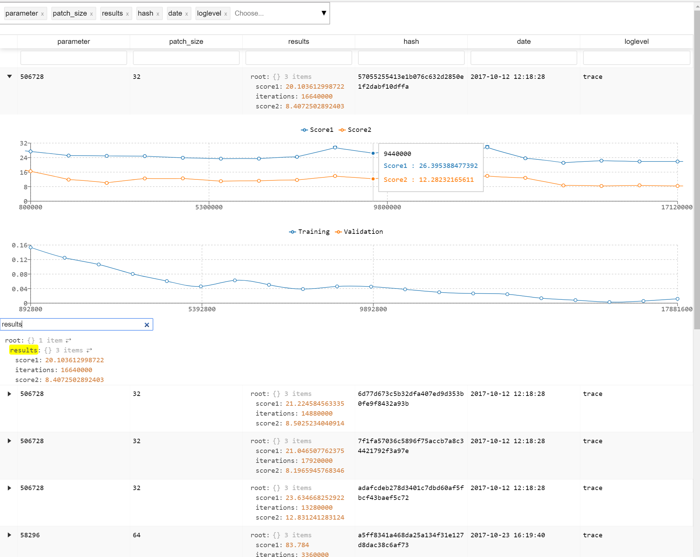
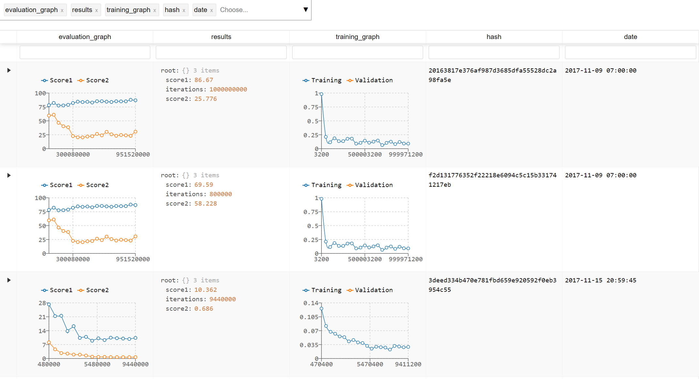

# Description

Parses a json file with an array of arbitrary objects and displays it as a
customizable table. Additionally supports rendering of graphs.

Table with expanded detailed view  for first row which shows all the
data in a searchable object tree + toplevel graphs:



In-row graphs:



# Build docker

```
git clone --recursive https://github.com/h0rm/react-graph-tests.git
cd react-graph-tests
docker build page-container .
```

# Run
```
docker run -it --rm -p <local port>:5000 --name page \\
           -v <local data folder>:/app/build/data page-container
```

```<local data folder>``` has to include a json file called
```table.json``` with an array as top level element. Page is published at ```http://localhost:<local port>```.


# Graph structure

In ```table.json``` add top level object to each array with the
tag ```$graph``` containing ```json```(json file with data), ```yaxis```
(array with tags of yaxis data), ```xaxis``` (tag of xaxis data).

Example:
```
...
"training_graph": {
     "$graph": {
       "json": "03273111-3759-4d4c-cd94-18b0941a61b6-g2.json",
       "yaxis": [
         "Training",
         "Validation"
       ],
       "xaxis": "Epoch"
     }
   }
...
```

The json file with data is an array of datapoints. Entries can be numbers,
```null``` or ```""``` (will be interpolated).

```0e430dcf-48d1-406c-c0d2-a2800481a9bf-g2.json``` Example:
```
[
  {
    "Epoch": 30348800,
    "Training": 0.1071133492142,
    "Validation": 0.2123123134921
  },
  {
    "Epoch": 60697600,
    "Training": 0.10179754845798,
    "Validation": ""
  },
  {
    "Epoch": 91046400,
    "Training": 0.095041927695274,
    "Validation": 0.18234523134921
  },
  {
    "Epoch": 121408000,
    "Training": 0.092138588428497,
    "Validation": ""
  },
  ...
]
```
